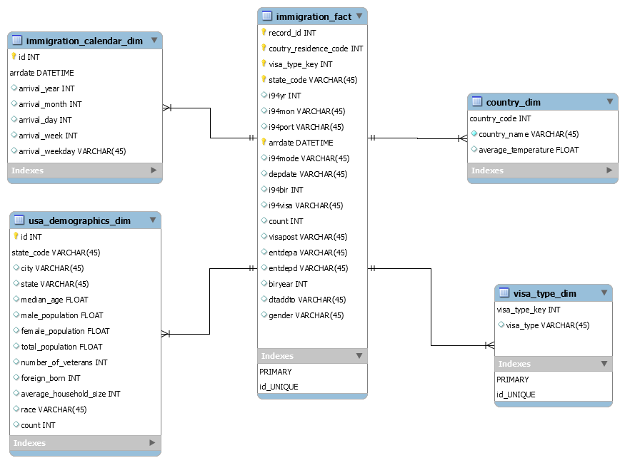

# Data Engineering Capstone Project

## Project Summary
The objective of this project was to create an ETL pipeline for I94 immigration, global land temperatures and US demographics datasets to form an analytics database on immigration events. A use case for this analytics database is to find immigration patterns to the US. For example, we could try to find answears to questions such as, do people from countries with warmer or cold climate immigrate to the US in large numbers?

## Data and Code
All the data for this project was loaded into S3 prior to commencing the project. The exception is the i94res.csv file which was loaded into Amazon EMR hdfs filesystem. 

In addition to the data files, the project workspace includes:
* **etl.py** - reads data from S3, processes that data using Spark, and writes processed data as a set of dimensional tables back to S3
* **etl_functions.py and utility.py** - these modules contains the functions for creating fact and dimension tables, data visualizations and cleaning. 
* **config.cfg** - contains configuration that allows the ETL pipeline to access AWS EMR cluster. 
* **Jupyter Notebooks** - jupyter notebook that was used for building the ETL pipeline.

## Prerequisites
* AWS EMR cluster
* Apache Spark
* configparser
python 3 is needed to run the python scripts.

### The project follows the following steps:
* Step 1: Scope the Project and Gather Data
* Step 2: Explore and Assess the Data
* Step 3: Define the Data Model
* Step 4: Run ETL to Model the Data
* Step 5: Complete Project Write Up

## Step 1: Scope the Project and Gather Data
### Project Scope
To create the analytics database, the following steps will be carried out:
* Use Spark to load the data into dataframes.
* Exploratory data analysis of I94 immigration dataset to identify missing values and strategies for data cleaning.
* Exploratory data analysis of demographics dataset to identify missing values and strategies for data cleaning.
* Exploratory data analysis of global land temperatures by city dataset to identify missing values and strategies for data cleaning.
* Perform data cleaning functions on all the datasets.
* Create dimension tables.
    * Create immigration calendar dimension table from I94 immigration dataset, this table links to the fact table through the arrdate field.
    * Create country dimension table from the I94 immigration and the global temperatures dataset. The global land temperatures data was aggregated at country level. The table links to the fact table through the country of residence code allowing analysts to understand correlation between country of residence climate and immigration to US states.
    * Create usa demographics dimension table from the us cities demographics data. This table links to the fact table through the state code field.
    * Create fact table from the clean I94 immigration dataset and the visa_type dimension.

The technology used in this project is Amazon S3, Apache Sparkw. Data will be read and staged from the customers repository using Spark.
## Step 2: Explore and Assess the Data
> Refer to the jupyter notebook for exploratory data analysis

## Step 3: Define the Data Model
### 3.1 Conceptual Data Model

The country dimension table is made up of data from the global land temperatures by city and the immigration datasets. The combination of these two datasets allows analysts to study correlations between global land temperatures and immigration patterns to the US.

The us demographics dimension table comes from the demographics dataset and links to the immigration fact table at US state level. This dimension would allow analysts to get insights into migration patterns into the US based on demographics as well as overall population of states. We could ask questions such as, do populous states attract more visitors on a monthly basis? One envisions a dashboard that could be designed based on the data model with drill downs into gradular information on visits to the US. Such a dashboard could foster a culture of data driven decision making within tourism and immigration departments at state level. 

The visa type dimension table comes from the immigration datasets and links to the immigaration via the visa_type_key. 

The immigration fact table is the heart of the data model. This table's data comes from the immigration data sets and contains keys that links to the dimension tables. The data dictionary of the immigration dataset contains detailed information on the data that makes up the fact table. 

### 3.2 Mapping Out Data Pipelines
The pipeline steps are as follows:
* Load the datasets
* Clean the I94 Immigration data to create Spark dataframe for each month
* Create visa_type dimension table
* Create calendar dimension table
* Extract clean global temperatures data
* Create country dimension table
* Create immigration fact table
* Load demographics data
* Clean demographics data
* Create demographic dimension table

## Step 4: Run Pipelines to Model the Data 
### 4.1 Create the data model
> Refere to the jupyter notebook for the data dictionary.

### 4.2 Running the ETL pipeline
The ETL pipeline is defined in the etl.py script, and this script uses the utility.py and etl_functions.py modules to create a pipeline that creates final tables in Amazon S3.
> spark-submit --packages saurfang:spark-sas7bdat:2.0.0-s_2.10 etl.py 

